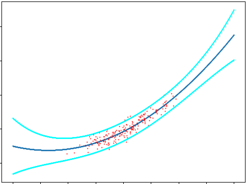

# Mathematics Samples
Collection of simple (and sometimes obscure) mathematics scripts.
Documentation for each project will be added, time permitting.

# Bayesian Linear Regression
Simple demonstration of Bayesian linear regression 
(assuming the data errors are known and constant, will pursue the
unknown case in the future with Wishart prior).

See the sample image below. The polynomial curve (black)
is fit onto the data (red). Notice that the error bars (blue)
are wider in areas farther from the data used for fitting; this
is the main benefit of using a Bayesian technique instead of
vanilla frequentist regression.

# Bayesian Logistic Regression

Simple demo of Bayesian Logistic regression. Decision boundary of 
P(y=Blue|Data)=P(y=Green|Data)=0.5 is plotted in red, while contours of the posterior
predictive are plotted for the contours P(y=Blue|Data)=c, where darker
contours indicate higher values of c. Posterior predictive is estimated
using bootstrap sampling. Notice how the sureness splays out farther
away from the training data: this is a useful part of Bayesian techniques
overall.

# Laplace Smoothing Viz

Nice video (see [manim](https://github.com/3b1b/manim)) demonstration of
the concept of Laplace (or "add-one") smoothing in the context of
estimating the fairness of a coin with very limited data. Checkout my
[personal website](http://matthewcampbell.io) to see it!

# Local Least Squares

Implementation of local least squares. Localized linear regressions
using a Gaussian kernel to fit to data generated from a sine wave.
Note that the hills and troughs aren't quite up to snuff, but 
using a polynomial local fit would likely solve the issue. More on
this later.

That's all for now! [Feel free to contact me!](http://matthewcampbell.io)
